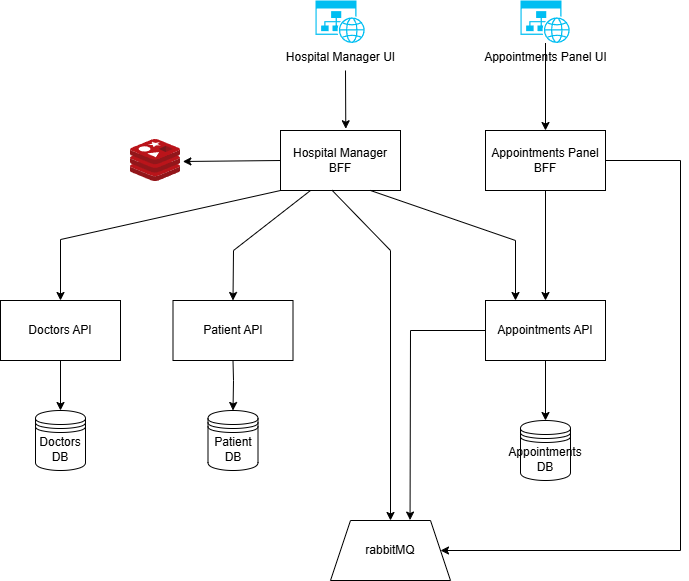

# Xaberue.Playground.HospitalManager

Sample project simulating a real hospital management system using mainly C# and .NET, but other technologies as well orchestrated with Aspire.

Aspire is the orchestration project, which contains the main entry point for the application. It is responsible for initializing the application and starting the necessary services.

# Project Structure
_TBD_

# Samples included
- Aspire orchestration
  - .NET services
  - Angular app
  - rabbitMQ
  - SQL Server
  - Redis
  - MongoDb
- Blazor
  - SSR
  - Interactive WebAssembly
  - Dealing with both server and client side
- SignalR
- Identity
- Minimal APIs
- gRPC
- EntityFrameworkCore
- Central package management
- SLNX

# Known Issues / To Be investigated

- SignalR is not implemented during the refresh in the Manager UI for appointments. _(TBI)_
- Identity is not used at the moment, roles are not considered within the manager UI. _(TBI)_
- Several best practices are required to be added:
  - Minimal API groups routing, specially in BFF projects.
  - Mappers extraction.
- Working with multiple instances, check logs, check servers.
- DistributedCache / HybridCache is not properly adding traces to OTEL collector. _(TBI)_
